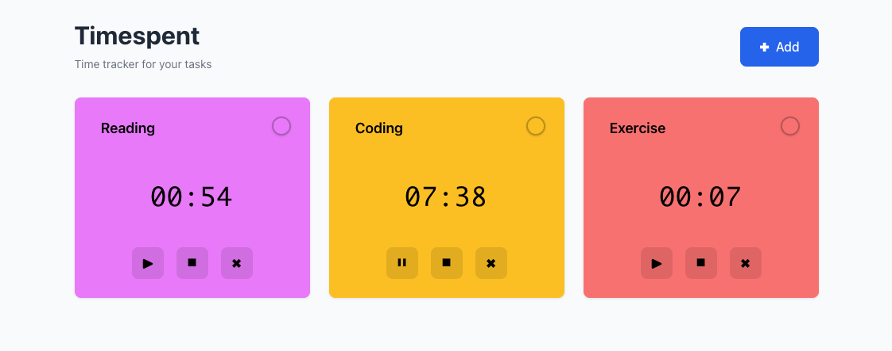

# Timespent

A simple, beautiful time tracker for your activities. Keep track of time spent on different activities with automatic saving and an intuitive interface.



## Features

**Multiple Timers** – Create and manage multiple timers simultaneously  
**Color Coding** – Assign colors to tasks for better organization  
**Editable Names** – Easily rename your timers  
**Auto-Save** – All data is automatically saved to your browser  
**Persistent State** – Your timers and data persist even after closing the tab  
**Responsive Design** – Works seamlessly on desktop and mobile  
**Undo Delete** – Recover deleted timers within 5 seconds  
**Keyboard Friendly** – Full keyboard navigation support

## Getting Started

### Prerequisites
- Node.js 18+ and npm

### Installation

```bash
npm install --legacy-peer-deps
```

### Development

```bash
npm run dev
```

Opens the app at [http://localhost:5176](http://localhost:5176) with hot module reloading.

### Build

```bash
npm run build
```

Produces optimized production build in `dist/`.

### Preview

```bash
npm run preview
```

Serves the production build locally.

## Usage

1. **Add a Timer** – Click the "Add" button to create a new timer
2. **Name Your Task** – Click on the timer name to edit it
3. **Start Tracking** – Press the play button to start the timer
4. **Pause/Resume** – Press the pause button to pause
5. **Stop/Reset** – Press the stop button to reset the timer
6. **Change Color** – Click the color circle to choose a color for your task
7. **Delete** – Press the delete button to remove a timer (can be undone within 5 seconds)

## How It Works

### State Management
- Uses React's `useReducer` for predictable state management
- Timestamp-based timing ensures accuracy even when the tab is backgrounded
- Global ticker using `requestAnimationFrame` for efficient updates

### Persistence
- All data is saved to `localStorage` automatically
- Debounced saves (300ms) reduce write frequency
- Graceful fallback to 1-second interval when tab is hidden
- Data survives browser restarts and tab closures
- Running timers pause when you close the tab and resume from the same point

## Architecture

### Components
- `Toolbar` – Header with title and add button
- `StopwatchList` – Grid layout of all timers
- `StopwatchItem` – Individual timer card with controls
- `UndoToast` – Delete confirmation toast

### Hooks
- `useTicker` – Global timestamp provider with visibility API integration

### Utilities
- `formatTime` – Converts milliseconds to MM:SS or HH:MM:SS format
- `getContrastColor` – WCAG 2.0 luminance calculation for accessible text colors

## Data Model

```typescript
interface Stopwatch {
  id: string
  name: string
  color: string
  accumulatedMs: number
  startedAt: number | null
  isRunning: boolean
  createdAt: number
}

interface StopwatchState {
  stopwatches: Stopwatch[]
  lastDeleted: {
    stopwatch: Stopwatch
    expiresAt: number
  } | null
}
```

## localStorage Schema

- **Key:** `stopwatches:v2` (versioned for future migrations)
- **Payload:**
  ```json
  {
    "version": 2,
    "stopwatches": [...],
    "lastDeleted": { "stopwatch": {...}, "expiresAt": 1234567890 }
  }
  ```

## Colors

Tasks can be assigned one of 10 Tailwind colors:
- Blue, Red, Emerald, Amber, Violet
- Pink, Cyan, Teal, Indigo, Fuchsia

Colors are automatically assigned to new timers, with the system selecting the first unused color.

## Accessibility

- Semantic HTML with ARIA labels
- Automatic contrast-aware text color (black/white) over backgrounds
- Keyboard navigation and focus management
- Screen reader friendly

## Testing

Test utilities are configured but tests not yet implemented. To add tests:

```bash
npm run test
npm run test:ui
```

Uses **Vitest** with React Testing Library and jsdom.

## Tech Stack

- **React 19.2** – UI framework
- **TypeScript 5.9** – Type safety
- **Vite 7.3** – Build tool and dev server
- **CSS Variables** – Styling system

## Performance

- Global ticker prevents per-timer intervals
- Debounced saves reduce storage write frequency
- Efficient re-renders using React.memo
- Automatic pause on tab background
- CSS transitions for smooth animations

## Browser Support

Modern browsers with ES2020+ support (Chrome, Firefox, Safari, Edge).

## License

MIT

